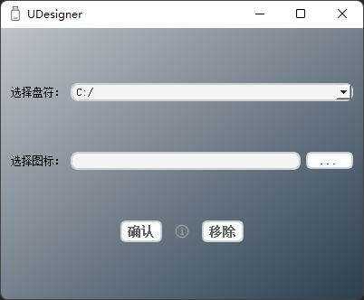

# UDesigner

#### 介绍
优盘个性化图标设置小程序，即可以给U盘设置自己喜欢的图标，不限于优盘，电脑磁盘也可以。不怕误删，因为文件通过“特殊方式”隐藏了，一般方法看不到，所以就不怕误删了。同时，很安全，因为核心原理基于Windows的cmd命令。

#### 原理
核心原理采用autorun.inf 和 Windows的attrib命令
#### 使用说明
注意，需要重启电脑或者插拔优盘才能生效。

